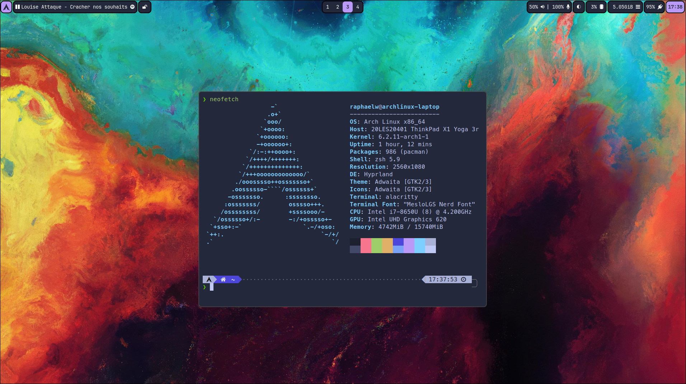

# My Linux Rice

<!--toc:start-->

- [Setup](#setup)
  - [Hardware](#hardware)
  - [OS](#os)
  - [Desktop environment](#desktop-environment)
  - [Development environment](#development-environment)
  - [Dotfiles management strategy](#dotfile-management-strategy)
  <!--toc:end-->

This repository stores all my linux configuration files that I wish to keep.

Feel free to browse the files for inspiration to configure a particular program.
I personally wouldn't recommend to blindly copy stuff from this configuration,
as it will likely be a pain to get working. Besides, what would be the fun in
that ?

## Setup

This screenshot was taken the 18/04/2023:

### Hardware

I have 2 machines, a laptop and a desktop. The laptop is a Lenovo Thinkpad Yoga
3rd gen, and the desktop is a custom built computer, with an AMD Ryzen 5800X for the
CPU and a AMD Radeon 6800 for the GPU.

### OS

I currently run ArchLinux on both computers, and do not plan on changing anytime
soon. I do keep an eye on NixOS though, which I've tried with mitigated success
to set up in the past.
I also maintain a dual boot with windows on the desktop computer, mainly to play
video games and occasionally use proprietary software that's not available on
Linux.

### Desktop environment

I run wayland on both computers, with my compositor being Hyprland. I use
pipewire for audio, alacritty or kitty for my terminal emulator, and a bunch of
other utilities to achieve common DE functionalities like backlight control,
volume control, etc.

### Development environment

I use neovim as my main text editor, but sometimes will use vscodium if my neovim
configuration lacks a specific feature.

### Dotfile management strategy

I have 2 machines, so there will obviously be some programs that require host
specific configuration, such as Waybar or Hyprland. Since 99% of the
configuration is shared, I split my configuration files in 3 folders :

- main
- desktop
- laptop

For programs requiring shared configuration, there will be a folder containing
the configurations files in each directory. Usually, the host specific file will
source or include the general configuration file. Both host specific files are
named the same. To distribute the files correctly, I use GNU Stow, with a little
script called `stow.sh` that will stow the correct packages depending on the
hostname. the script `stowRoot.sh` will do the same but for root level
configuration files (ex: httpd.conf). The special directory contains files that
need to go in specific places that aren't in the $XDG_CONFIG_HOME folder (in my
case it's the default ~/.config). Finally, the scripts directory contains shell
scripts that are used either directly by the user, or by configured programs.
These are stowed in `~/.local/bin` to be in the $PATH.
